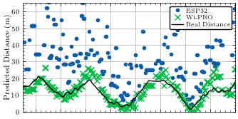

# wi-pro-esp32-ftm

*Accurate Range+CSI on the ESP32 using Multipath Compensation*





# Building

The firmware is written in rust using `esp-idf-sys` with embassy. The `controller` is a separate rust project.

1. Install rust: https://rust-lang.org/tools/install/

2. Install esp-rs prereqs

```
sudo apt-get install git wget flex bison gperf python3 python3-pip python3-venv cmake ninja-build ccache libffi-dev libssl-dev dfu-util libusb-1.0-0
pip3 install esptool

cargo install cargo-generate
cargo install ldproxy
cargo install espup
cargo install espflash
cargo install cargo-espflash # Optional

espup install

```

## Quick Start

```
./build.sh # build everything
./flash.sh /dev/ttyACM0  # flash the firmware to the ESP (replace /dev/ttyACM0 with ESP's device file)
./controller/controller -p /dev/ttyACM0 -o ./data # connect to the ESP, save FTM/CSI data to ./data
```

## Building and flashing the firmware

```
./build_firmware.sh
```

This should install firmware binaries and object files for debugging in `firmware/bin`. Once you have built, you can run.

```
./flash.sh /dev/ttyACM0 #fill in USB dev for your machine
```

to download the firmware to the esp32

On linux the esp32-s3 will usually be assigned `/dev/ttyACM0`, on MacOS it usually gets assigned to `/dev/cu.usbmodem0`

`build_firmware.sh` which runs `cargo build`, plus a few additional project-specific steps:

-  Run `scripts/create_idft_mat.py` to create the IDFT matrix binary data used to do the up-sampling IDFT, the matrices are compressed with SVD and baked into firmware image themselves to save on RAM, so they need to be pre-generated.

-  Install patches to `esp-idf` to expose the raw mac timestamp in CSI callback. `cargo build` attempts to download and build all of `esp-idf` internally on the first build, so the first time you run the script, it will build esp-idf-sys twice (run cargo build to download esp-idf, then patch esp-idf, then rerun to build with the patch.)

`build_firmware.sh` does all of this and then copies the final binaries into `firmware/bin`.

## Building the controller and connecting to the ESP32

```
./build_controller.sh
```

The ESP32 dumps raw CSI and FTM data over the USB, so we have built a small host binary `controller` which decodes this data and stores it in `csv` files for easy processing. It can also send data to a remote server via ZMQ, for aggregation of data from multiple ESPs together.

Once the ESP32 is flashed, you can connect to it by running

```
./controller/controller -p /dev/ttyACM0
```

Optionally, add `-o data` to save outputs in a folder called `data`. If the folder is non-empty, controller will create a unique subfolder to ensure you don't overwrite existing log files.
